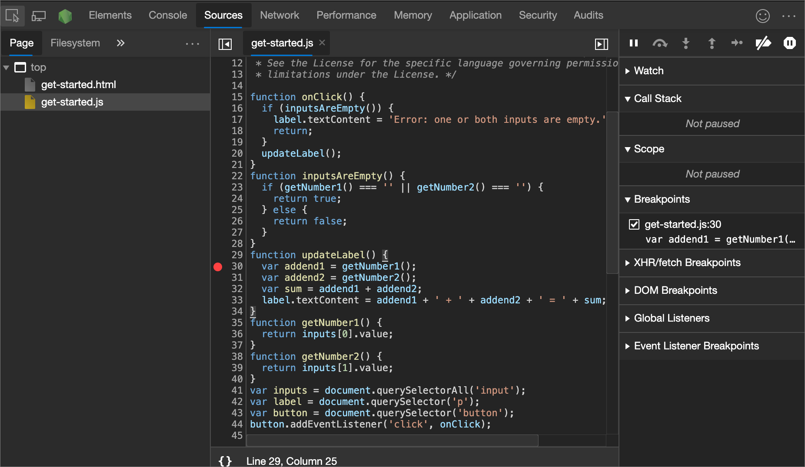

# Class 10: Debugging

Arguably, the one thing you will do most when writing code in any language is debugging errors. Writing code is comparable to writing a dissertation for an AI-powered professor with a grudge against you. For this reason, knowing how to debug your code is the most important skill to have as a developer.

## Troubleshooting JavaScript

### Name some key differences between a Syntax Error and a Logic Error

Syntax errors relate to the structure and grammar of the code and prevent it from running, while logic errors are errors in the program's logic that result in incorrect behavior or unintended outcomes. Logic errors are more subtle and can be harder to detect and fix compared to syntax errors.

### List a few types of errors that you have encountered in past lab assignments and explain how you were able to correct them

Some of the errors I came across in my past labs were syntax errors. However, most were reference errors (referencing a variable that was never declared). Examples include:

- Syntax error: forgetting to closing parentheses or brackets.
- Logic error: attempting to use a forEach loop to loop through an object that isn't iterable.
- Syntax error: misspellings of built-in functions.

### How will this topic continue to influence your long term goals?

This topic will always be at the forefront of by long-term developer journey and will continuously influence push me to pay more attention to detail when coding. I will also utilize more linting tools.

## The JavaScript Debugger

### How would you describe the JavaScript Debugger tool and how it works to someone just starting out in software development?

The JavaScript Debugger is a tool that is essential for identifying and fixing issues in your JavaScript code. It helps you investigate and understand how your code executes, making it an invaluable resource for software development.

The Debugger allows you to examine and inspect your code step by step to uncover the issues that may be causing problems in your program.

### Define what a breakpoint is

A **breakpoint** is a specific point in your code where you instruct the debugger to pause execution, allowing you to inspect the program's state, variables, and behavior at that moment.

Like a "pause" button for your code, just as you might hit pause button during a movie to analyze a scene.

### What is the call stack?

The **call stack** is an abstract data structure in computer science that functions as a record-keeping mechanism, systematically managing the sequence and hierarchy of function calls and their respective context in a program's execution.

It tracks the order in which functions are invoked and manages the flow of control, aiding in the maintenance of program state and facilitating the return from nested function calls to ensure smooth program execution.

## Things I want to know more about

Nothing at the moment.

## Sources

- Very minimal use of ChatGPT
- [What went wrong? Troubleshooting JavaScript](https://developer.mozilla.org/en-US/docs/Learn/JavaScript/First_steps/What_went_wrong)
- [The JavaScript Debugger](https://developer.mozilla.org/en-US/docs/Learn/Common_questions/Tools_and_setup/What_are_browser_developer_tools#the_javascript_debugger)
