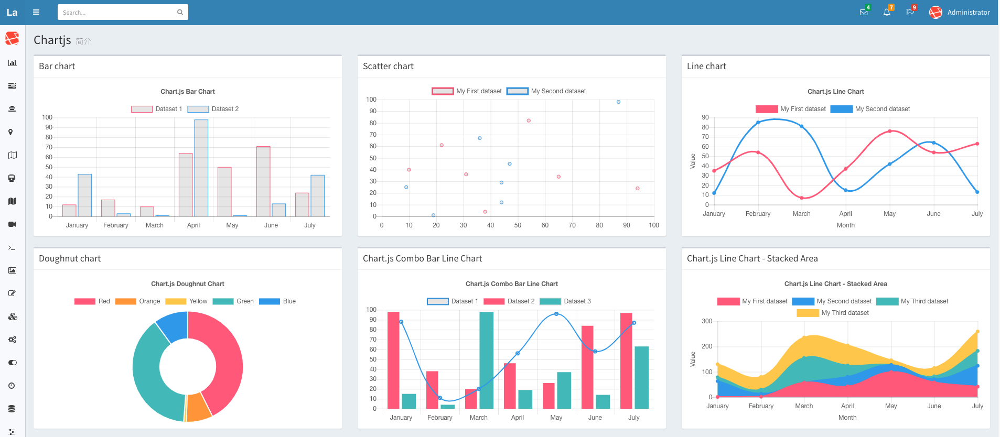

# Class 12: Chart.js, Canvas

## JavaScript Canvas

### What does the `<canvas>` allow a developer to achieve?

The `<canvas>` element allows developers to draw 2D graphics using JavaScript.

### What is the importance of the closing `</canvas>` tag?

It is important to close the `</canvas>` element because all content within the element
is considered **fallback** content and will not render/show unless the browser does not
support `<canvas>`; therefore, anything after the opening tag will not show.

### Explain what the getContext() method does

The `getContext()` method returns a render context object.

## Chart.js Documentation

### What is Chart.js and how it can be brought into your project?

Chart.js is a charting library for JavaScript. It can be brought into
a project through multiple ways:

    - By using a framework (React, Vue, Svelte, etc.) and adding it with a package manager 
        (NPM, Yarn, etc.).
    - Through CDN by adding the script's link in a script element.

### List 3 different Chart types you can create using Chart.js

Three different types chart types you can create with Chart.js are:

    - Bar chart
    - Line chart
    - Pie chart

## Easily Create Stunning Animated Charts with Chart.js

### What are some advantages to displaying data via a chart over a table?

Some advantages of displaying data via charts over tables:

- Conveys data quickly and efficiently
- Data is more visually appealing

### How could Chart.js aid your previously created applications visually?

Chart.js can aid previously created applications that present data in tables or just raw
text by improving data visualization, by making the data presented be more interactive, by
showing comparisons and trends, and they inherently add responsiveness.

## Things I want to know more about

Nothing at the moment.

## Sources

- [JavaScript Canvas](https://www.javascripttutorial.net/web-apis/javascript-canvas/)
- [Chart.js Documentation](http://www.chartjs.org/docs/)
- [Easily Create Stunning Animated Charts with Chart.js](https://www.webdesignerdepot.com/2013/11/easily-create-stunning-animated-charts-with-chart-js/)
