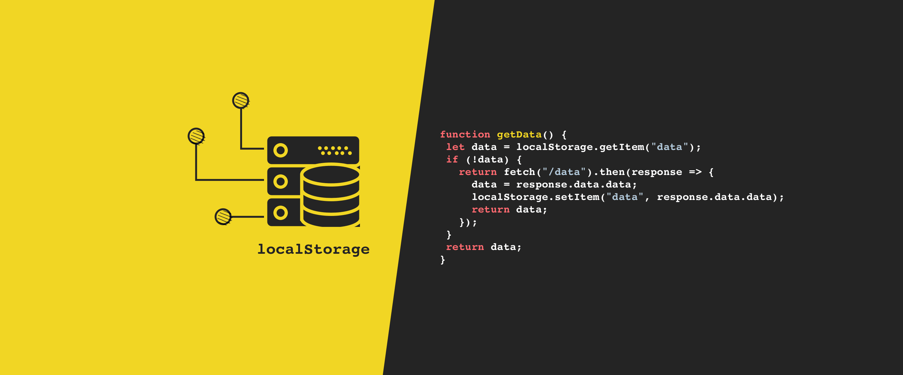

# Class 13: Introduction to Persistence with Local Storage

As a developer, having intimate knowledge about persistence with local storage
is important for several reasons
    - **Data Retention**: Local storage allows web applications to store data on the user's device, so
        the data persists even if the user closes their browser or navigates away from the website.
        This is crucial for applications that need to remember user preferences, settings, or data
        between sessions.
    - **Improved User Experience**: Utilizing local storage can enhance the user's experience by reducing
        the need for users to re-enter information, such as login credentials or preferences, every time
        they visit a website. This can lead to higher user satisfaction and increased engagement.
    - **Reduced Server Load**: Storing data on the client-side with local storage reduces the need for
        frequent server requests, which helps reduce server load and improves website performance.
        It also conserves bandwidth by reducing the amount of data sent between the client and server.

## Local Storage and How To Use It On Websites

### Why would a developer use local storage for a web application?

As a developer, you want to optimize your applications and improve user experience as much as possible.
One of the key ways to achieve these goals is by utilizing local storage. HTTP transmissions are
**stateless**, which means data sent back and forth on the internet only last as long as you are interacting
with it. Once you close the application or browser, the data vanishes. In order to persist the data, some form
of long term storage must be implemented. This is where a developer would incorporate local storage as a means
of long term storage.

### What information should not be stored in local storage?

Any sensitive data, such as Personal Identifiable Information (PII), credit card information, passwords, etc.,
should not be stored on local storage.

### Local storage can store what type of data? How would you convert it to that type before storing?

The drawback of local storage is that you can only store the strings datatype as the value of keys,
not objects. To get around this shortcoming; however, we can use the `JSON.stringify()` and `JSON.parse()`
methods to store objects as a string, and then parse them into objects when we need them.

## Things I want to know more about

I want to know more about the amount of data that can be "feasibly" stored in local storage and the strain
it can possibly cause on the user's system if the that hypothetical max is being reached.

## Sources

- [Local Storage and How To Use It On Websites](https://www.smashingmagazine.com/2010/10/local-storage-and-how-to-use-it/)
- [The Past, Present, and Future of Local Storage for Web Applications](http://diveinto.html5doctor.com/storage.html)
