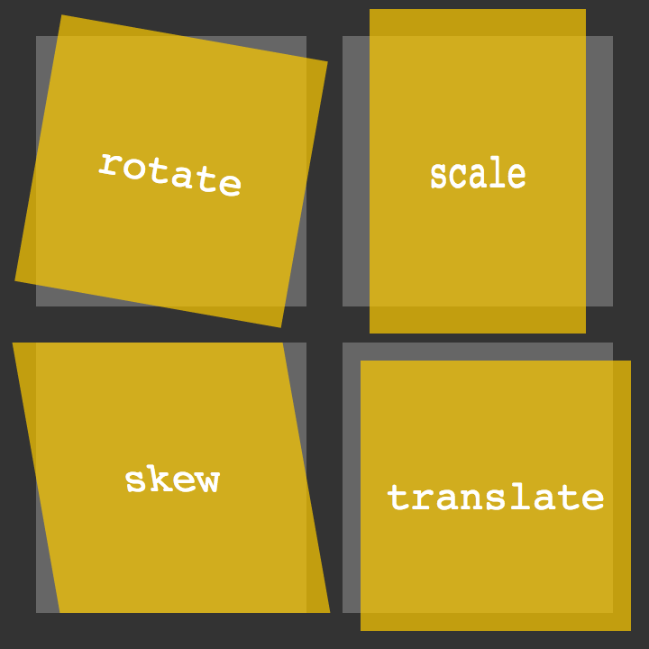

# Class 14: CSS

## CSS Transforms

### What does a CSS transform allow the developer to do to an element?

A CSS **transform** allows developers to modify the visual presentation of an element by applying
transformations such as `translation`, `rotation`, `scaling`, and `skewing`. This enables dynamic changes
to the position, size, and orientation of the element without affecting its layout in the document.
The transform property provides a versatile toolset for creating visually engaging and interactive
web designs.

### Provide an example of a transform and how you could see that being used on a website

An example use of the CSS transform property would be to create a visually appealing card-flip effect
for a website's product gallery. By applying the `rotateY(180deg)` transform, you could seamlessly
transition between the front and back faces of a card element, revealing additional product details
or alternate images when users hover over it. This transformation adds an interactive and engaging
element to the user experience, providing a dynamic way to showcase information without cluttering
the main layout.

## CSS Transitions & Animations

### How does a CSS animation differ from a CSS transition?

A CSS `animation` and a CSS `transition` are both techniques for adding dynamic movement to web elements,
but they differ in their fundamental nature. A CSS transition is a state change effect that occurs when a
property value changes, smoothly transitioning between the initial and final states over a specified duration.
In contrast, a CSS animation allows for more complex and continuous motion by defining `keyframes` that
specify the **style** properties at different points in time. While transitions are generally triggered by
changes in state, animations provide greater control over the entire sequence of movements, making them
suitable for more intricate and dynamic visual effects on a webpage.

## 8 simple CSS3 transitions that will wow your users

### What are some benefits to using CSS transitions on websites?

Using CSS transitions in web design offers several benefits:  

- Transitions provide a polished and smooth appearance to state changes, making the interface more visually pleasing.
- They contribute to a more intuitive and responsive design by guiding users through interface alterations with subtle
  animations, improving the overall flow and comprehension of the user interface.
- CSS transitions can help create a more engaging and dynamic website without relying on heavy JavaScript implementations,
  leading to faster load times and better performance.

### How this topic fit in with your long-term goals?

I foresee this topic being of great benefit as I traverse through my career. CSS is a beast, and I aim to tame it. My goal
is to become a freelance developer for hire, and I believe mastering CSS will propel goal.

## Things I want to know more about

Nothing at this very moment.
