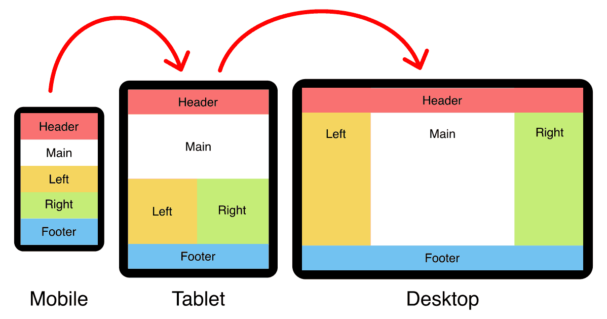

# Class 04: HTML Links, JS Functions, and Intro to CSS Layout

The major importance of this module/class is the expansion of knowledge of CSS. Although JavaScript is more complex, effective implementation of CSS styling in webpages is far more crucial and time-consuming. As we move forward, scrutiny of the how our webpages flow visually will become crucial.

## HTML

### To create a basic link, we wrap text or other content inside what element?

To create a basic link, we would wrap text or other content with an **anchor** (`<a>content</a>`) element.

### The href attribute contains what information?

The `href` attribute contains the **Hypertext Reference** (or the URL of the linked webpage/website).

### What are some ways we can ensure links on our pages are accessible to all readers?

Two ways to ensure links on your page are accessible to all readers are:

* Use clear and descriptive link text (not something non-descriptive such **Click here**)
* Avoid using the link reference as the link text

## CSS Layout

### What is meant by “normal flow”?

Normal flow is the way your the elements on a webpage renders and lays without changing the original layout.

### What are a few differences between block-level and inline elements?

Block-level elements relate to their parent element by grow to fill the inline space available inside the parent element.
Inline elements, on the other hand, are the exact size of their content.

### ___ positioning is the default for every html element

Static

### Name a few advantages to using absolute positioning on an element

Absolute positioning becomes advantageous when creating modals (dialogue boxes that pop of the page content),
drag and drop items, control menus, and other UI features.

### What is a key difference between fixed positioning and absolute positioning?

Absolute positioning places an element relative to its nearest parent.
Fixed positioning places an element relative to the visible viewport.

## JS

### Describe the difference between a function declaration and a function invocation

Function declaration is a way to name and define a function (you are essentially creating the function).
Function invocation involves the actual calling (or the use) of the function.

### What is the difference between a parameter and an argument?

Parameters are defined during the creation of the function and are variables that can be passed to the function.
Arguments are essentially the values passed as the parameter values when calling (or running) the function.

## Pair Programming

### Pick 2 benefits to pair programming and reflect on how these benefits could help you on your coding journey

Two benefits of pair programming that are potentially useful to me are:

* **Greater efficiency**: I tend to make a significant amount of syntax mistakes and typos. Having another developer co-code with me would assist in quickly identifying errors.
* **Learning from fellow students**: The diversity of this class would definitely allow me to explore areas of coding knowledge that I lack by picking the brains of my fellow students during a coding collaborations.

### Things I want to know more about

CSS positioning, my weakness.
