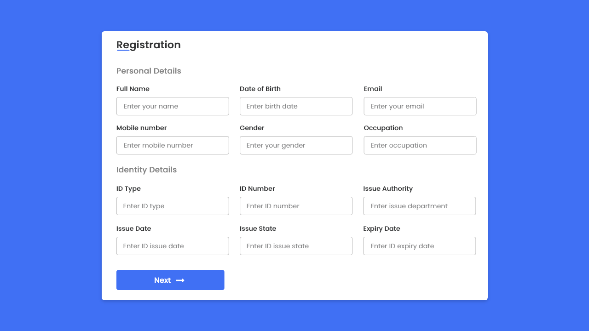

# Note 9

## HTML Forms

Almost every webpage you will come across utilizes forms for user interaction.
Whether it is a search box or a login form, you would be hard-pressed to find
a webpage that doesn't use HTML forms. For this reason, it is extremely important
as a developer to become familiar with using the HTML form element.

### Why are forms so important in web development?

Forms are important in web development because they are the main user interactive elements on a website.
Forms allow users to input data and for back-end servers to receive data for processing and storage.

### When designing a form, what are some key things to keep in mind when it comes to user experience?

When designing a form, a key point to keep in mind regarding user experience is the size of the form.
Users tend to get frustrated at large forms with multiple inputs, so keeping the forms as short possible
is a must.

### List 5 form elements and explain their importance

Five form elements:

* **form**: the element that creates the form. Forms start with a `<form>` element.
* **input**: creates interactive controls of different types that accepts user data.
* **label**: creates a caption for an interactive element inside the form.
* **textarea**: creates a multi-line text editor that allows users to input long text for processing.
* **button**: creates an action button that usually submits and performs actions on the input data.

## JS Events

### How would you describe events to a non-technical friend?

JavaScript events are like actions or triggers that happen on a web page when you interact with it.
For example, turning on the lights whenever you enter a room. The action of turning on the light is
could be considered an event. In a similar way, when you click a button on a web page, move your
mouse over an image, or submit a form, those are events in JavaScript.

### When using the addEventListener() method, what 2 arguments will you need to provide?

* **Event Type**: a special string that signifies the event
* **Event Handler**: a function that will run when the event is recognized

### Describe the event object. Why is the target within the event object useful?

The event object is a special object that contains information about an event that has fired
(i.e. a mouse click or any other user interaction with a web page). It provides details about
the event, including the type of event, the target element that triggered the event, and
additional event-specific data.

The target within the event object is useful because it reports which element triggered the event.

### What is the difference between event bubbling and event capturing?

In event bubbling, the event starts from the point of interaction and works its way up the ancestral tree.
Event capturing does the opposite; it starts at the root element and works it's way down to the target element.

## Things I want to know more about

I want to know more about event listeners and also  how to output post data inside the dom.
