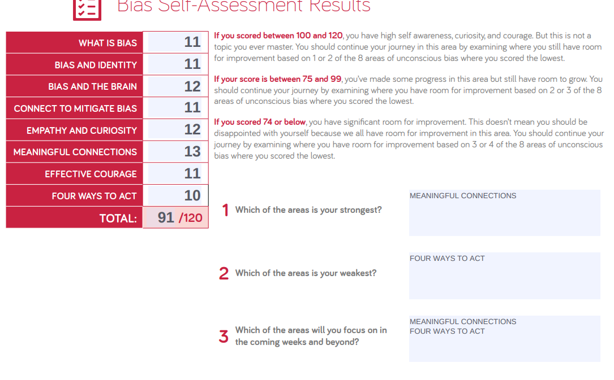

# Prep: The Growth Mindset

## Why This Topic Matters

Having a "growth mindset" is fundamental for personal and professional development. It involves perceiving abilities and intelligence as qualities that can be developed through dedication and hard work. This mindset fosters a love for learning, resilience in the face of challenges, and a drive to improve. Individuals with a growth mindset view failure not as evidence of unintelligence, but as a springboard for growth and for stretching existing abilities. This perspective encourages continuous learning, adaptability, and embracing challenges, which are crucial for success in an ever-evolving world.

## Measuring Emotional Intelligence

This self-assessment, much like the Professional Competency Assessment, was extremely eye-opening. For this assessment, I enlisted the aide of a close friend. I wanted to get a difference of how I perceive myself and how others perceive me. And the results were close; however, it proved that I see myself in a much better light than others do (at least close friends). Also, I am less socially aware than I thought, based on both my assessment and my friend's. Below are the final results:

- Self-Awareness: **18**
- Self-Management: **21**
- Social Awareness: **16**
- Relationship Management: **11**

## Biases Self Assessment

The self-assessment questionnaire results indicate a total score of **91** out of **120**, suggesting a moderate level of self-awareness, curiosity, and courage in addressing biases. The strongest area identified is "**Meaningful Connections**," while the weakest is "**Four Ways to Act**." I plan to focus on improving both these areas in the coming weeks. This score range indicates some progress in understanding and managing unconscious biases, but also highlights areas where further growth and development are needed.

## Things I want to know more about

Nothing at the moment.
