# Prep: SQL Practice

## Relational Databases and Structured Query Language (SQL)

Relational databases are a type of database management system (DBMS) that organizes and stores data in a structured manner using tables with rows and columns.
The relationships between these tables are defined based on common fields, fostering data integrity, and facilitating efficient retrieval and manipulation of information.

**SQL** (Structured Query Language) is the standard language used to interact with relational databases. It provides a set of commands for various tasks, such as creating and modifying database structures, querying data, and managing the content of databases. SQL enables users to perform operations like retrieving specific data, updating records, inserting new data, and deleting information, making it a crucial tool for database administrators, developers, and anyone involved in working with structured data.

## SQL Bolt Completed Lesson Screenshots

### Lesson 1: SELECT Queries 101

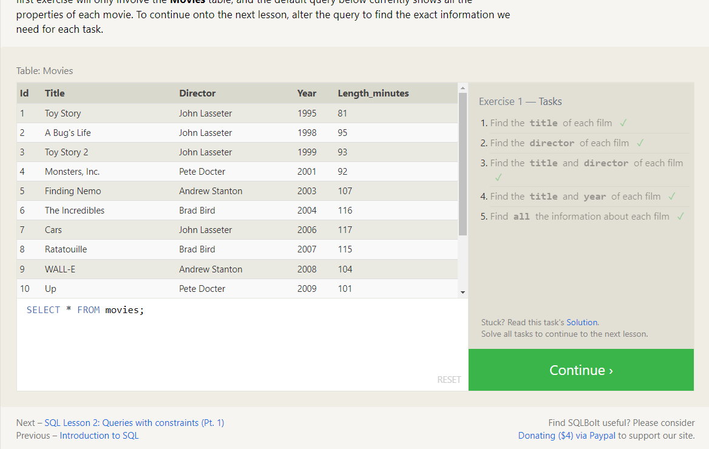

### Lesson 2: Queries with constraints (Pt. 1)

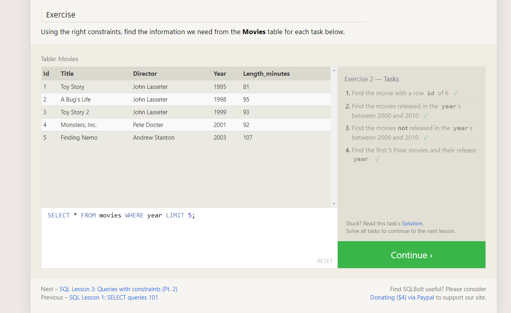

### Lesson 3: Queries with constraints (Pt. 2)

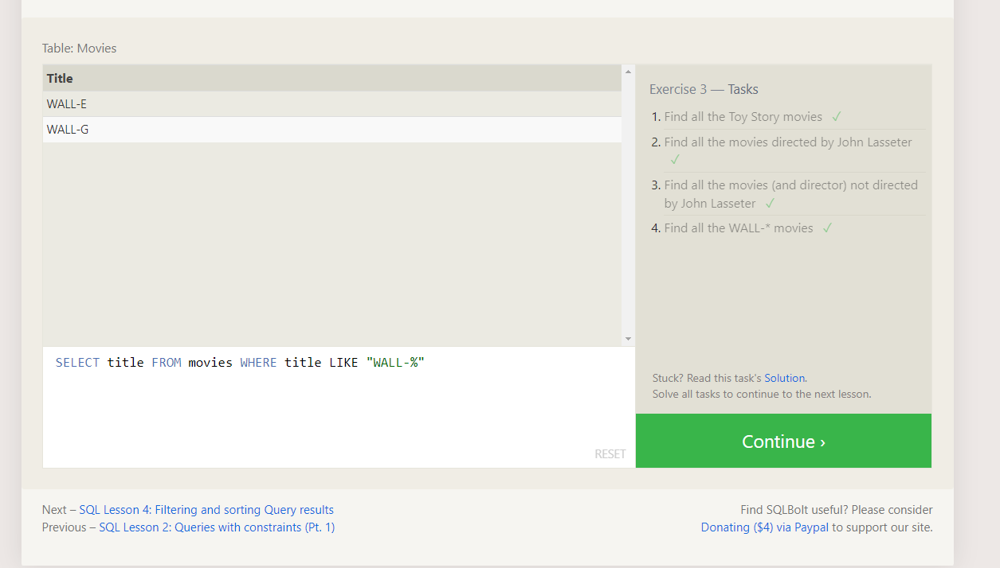

### Lesson 4: Filtering and Sorting Query Results

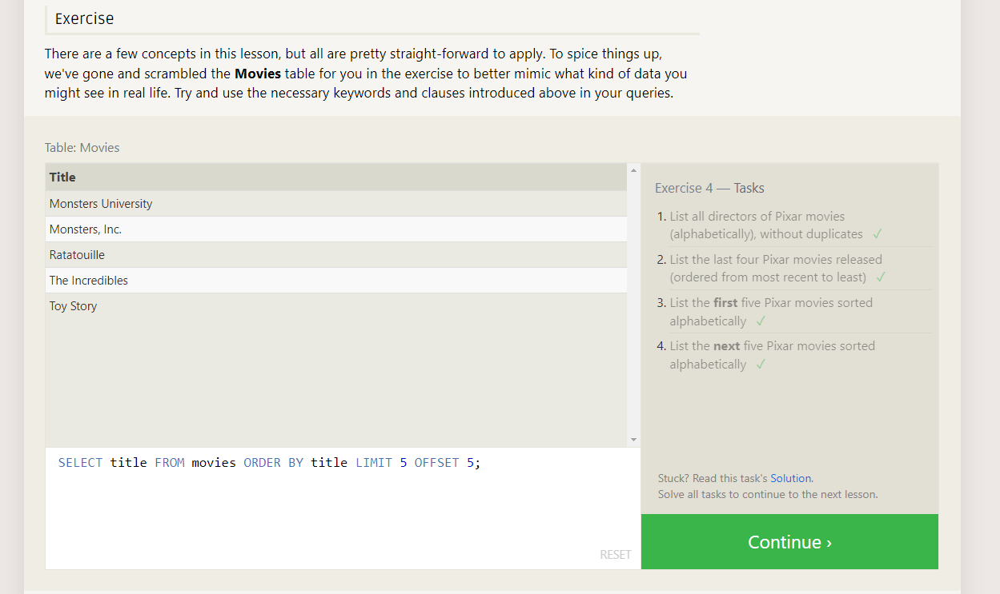

### Lesson 5: Simple SELECT Queries

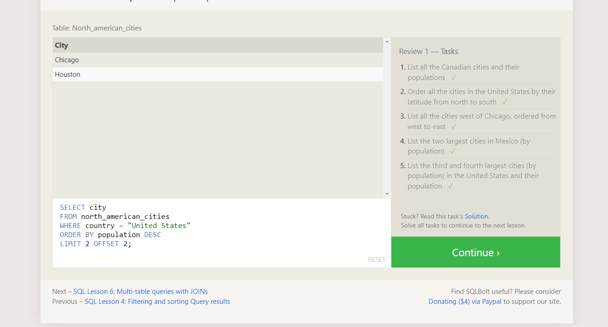

### Lesson 6: Multi-Table Queries with JOINs

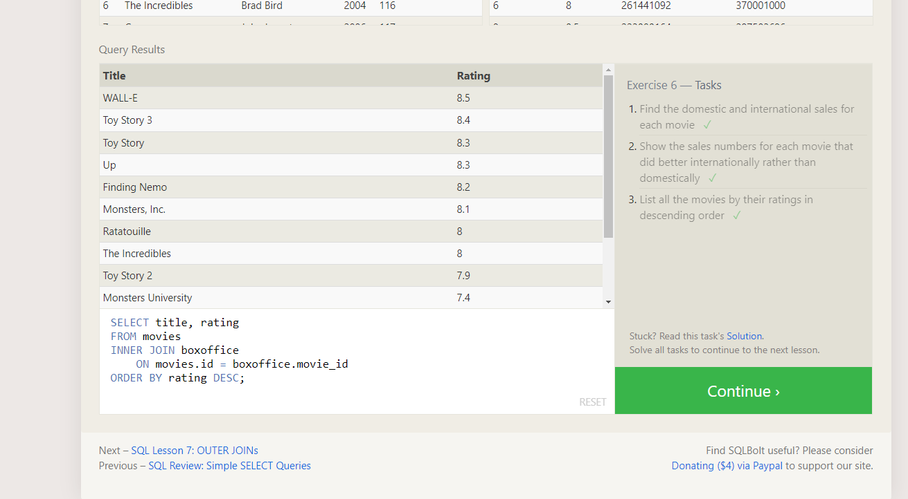

### Lesson 13: Inserting Rows

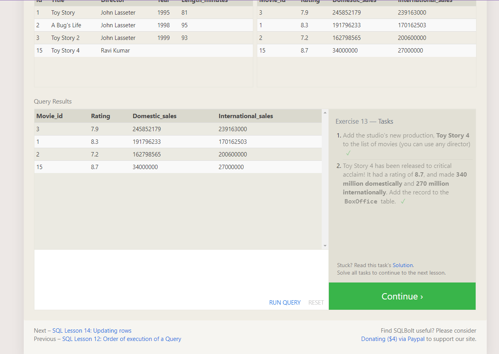

### Lesson 14: Updating Rows

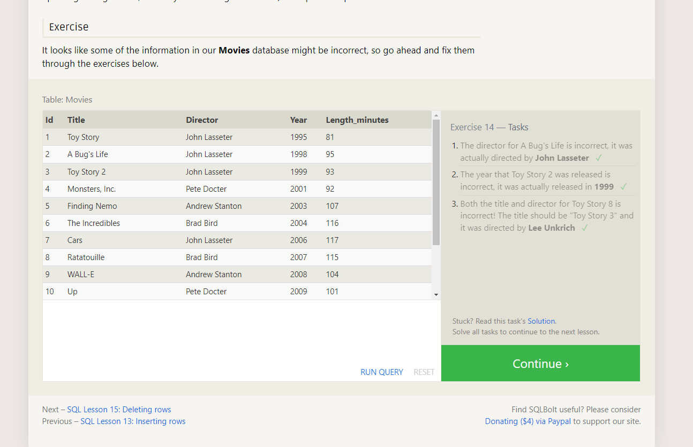

### Lesson 15: Deleting Rows

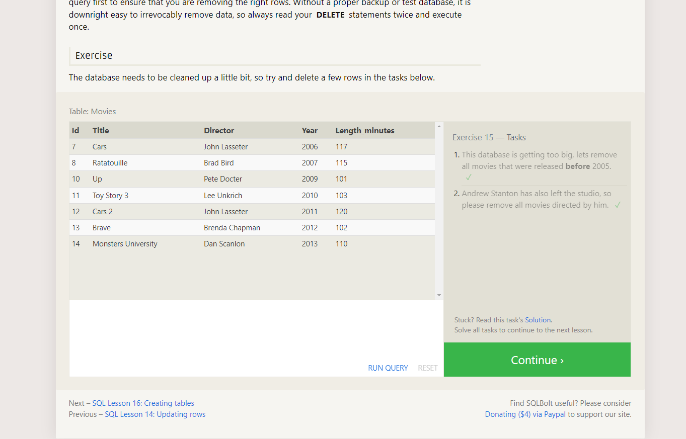

### Lesson 16: Creating Tables

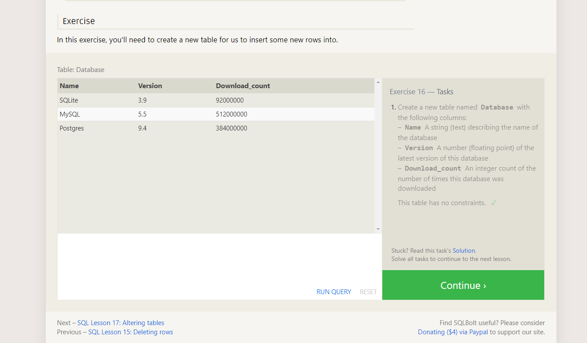

### Lesson 17: Altering Tables

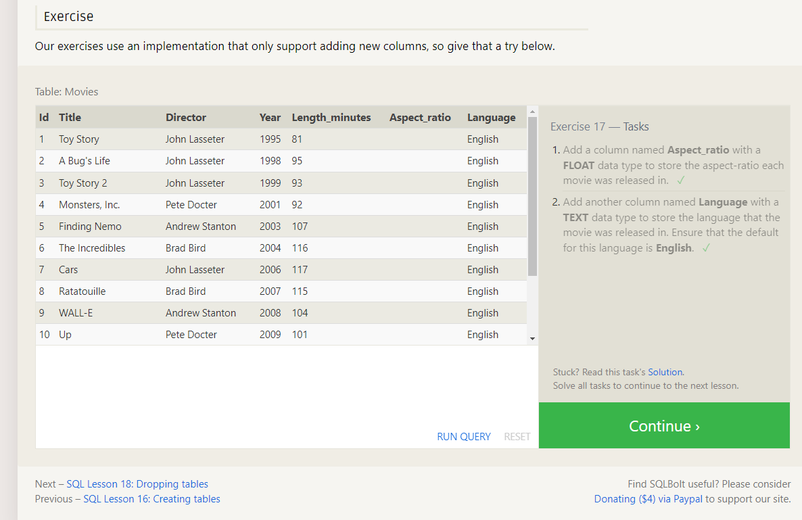

### Lesson 18: Dropping Tables

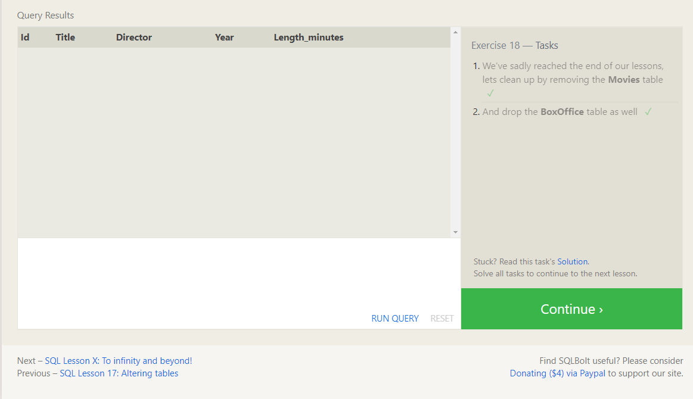

## Resources

- [SQL Database Tutorial for Beginners](https://www.computer-pdf.com/3-sql-database-tutorial-for-beginners)
- [SQL Bolt Tutorials](https://sqlbolt.com/)
