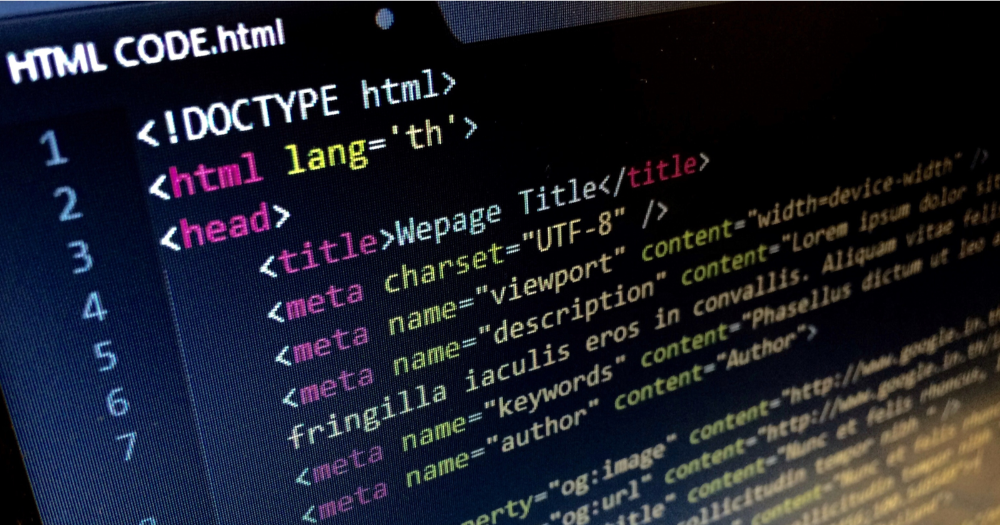

# Reading Notes

## The "Growth Mindset"

A **growth mindset** is a manner of thinking that beckons the thinker to continuously self-improve, through hard work and dedication, regardless of the thinker's level of proficiency on a subject. The growth mindset is in direct contrast to a `fixed mindset`, in which an individual believes he/she/they are at the peak of his/her/their abilities and intelligence on a particular subject.

The **growth mindset** enables the thinker to always search for new and innovative ways to solve problems, rather than relying on an archaic, *"This is how it has always been done"* mentality. This **fixed mindset** thinking can cripple a person or organization's innovation, ingenuity, and ultimately, their growth.

## Three reminders to keep a growth mindset

* **Embrace Challenges**: A problem may be solved today, but may evolve tomorrow so stay open-minded and ready for a challenge.
   > Never run from a challenge
* **Hard Work and Effort**: Maintaining a growth mindset cannot be achieved without putting in effort.
   > Put in the work
* **Failures Are Lessons**: Do not let failure prevent you from attempting difficult tasks.
   > You only fail when you quit

## About Me

Greetings fellow traveler! My name is Ekow (pronounced 'echo') Yawson. I am a US Army Veteran, father, and your favorite IT guy. I currently reside in Maryland, so all of you West Coasters bear with me regarding the time difference :). Tinkering and solving complex problems is my most cherished past-time, which has translated well into my fledgling IT career. I have used YouTube and random online courses to become fairly proficient in JavaScript, Python, and BASH scripting. I've also built a few websites and web applications using different frameworks. My goal in this course (and subsequent courses here at Code Fellows) is merge my raw skills with the institutional knowledge required to be a fully qualified developer.

## Portfolio

Click [here](https://github.com/ekowyawson) to visit my GitHub portfolio.

## Code 102 - Intro to Software Development

1. [Learning Markdown](https://ekowyawson.github.io/reading-notes/102-notes/1_learning-markdown)
1. [The Coder's Computer](https://ekowyawson.github.io/reading-notes/102-notes/2_the-coders-computer)
1. [Revisions In The Cloud](https://ekowyawson.github.io/reading-notes/102-notes/3_revisions-and-the-cloud)
1. [Structure Web Pages With HTML](https://ekowyawson.github.io/reading-notes/102-notes/4_structure-web-pages-with-html)
1. [Design Web Pages With CSS](https://ekowyawson.github.io/reading-notes/102-notes/5_design_web_pages_with_css)
1. [Activate Web Pages With JavaScript](https://ekowyawson.github.io/reading-notes/102-notes/6_activate_web_pages_with_javascript)
1. [Programming With JavaScript](https://ekowyawson.github.io/reading-notes/102-notes/7_programming_with_javascript)
1. [Operators and Loops](https://ekowyawson.github.io/reading-notes/102-notes/8_operators_and_loops)

## Code 201 - Foundations of Software Development

1. [Class 01 - Setup Developer Toolbelt](https://ekowyawson.github.io/reading-notes/201-notes/note_1)
1. [Class 02 - Introduction To Web Development](https://ekowyawson.github.io/reading-notes/201-notes/note_2)
1. [Class 03 - Lists, The Box Model, and Loops](https://ekowyawson.github.io/reading-notes/201-notes/note_3)
1. [Class 04 - Links, Layouts, and Functions](https://ekowyawson.github.io/reading-notes/201-notes/note_4)
1. [Class 05 - Images, Color, Text, and More Work With Functions](https://ekowyawson.github.io/reading-notes/201-notes/note_5)
1. [Class 06 - Domain Modeling, Intro to the DOM, and Object Literal Notation](https://ekowyawson.github.io/reading-notes/201-notes/note_6)
1. [Class 07 - HTML Tables and JS Constructor Functions](https://ekowyawson.github.io/reading-notes/201-notes/note_7)
1. [Class 08 - Layout with CSS](https://ekowyawson.github.io/reading-notes/201-notes/note_8)
1. [Class 09 - Forms and Events](https://ekowyawson.github.io/reading-notes/201-notes/note_9)
1. [Class 10 - Debugging and Error Handling](https://ekowyawson.github.io/reading-notes/201-notes/note_10)
1. [Class 11 - Audio and Video in HTML; Domain Modeling Revisited](https://ekowyawson.github.io/reading-notes/201-notes/note_11)
1. [Class 12 - Canvas and ChartJS](https://ekowyawson.github.io/reading-notes/201-notes/note_12)
1. [Class 13 - Introduction to Persistence with Local Storage](https://ekowyawson.github.io/reading-notes/201-notes/note_13)
1. [Class 14 - Documentation, Project Selection, & Team Workflow](https://ekowyawson.github.io/reading-notes/201-notes/note_14)
1. [Class 15 - Course Recap & 301 Preview](https://ekowyawson.github.io/reading-notes/201-notes/note_15)

## Code 301 - Intermediate Software Development

## Code 401 - Advanced Software Development
